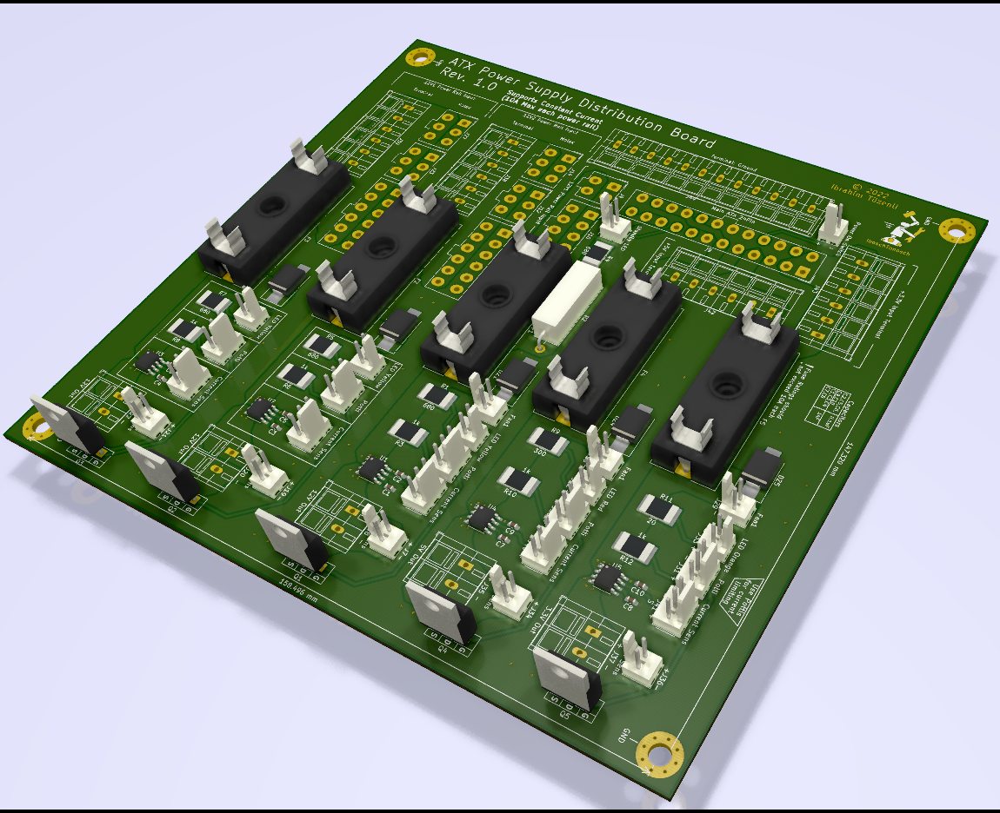

# atx-to-lab

You need the following tools to view or edit the files
* [KiCAD](https://kicad.org) - Edit PCB and Schematic files (.pro, .pcb, .sch).
* [FreeCAD](https://freecadweb.org) - Edit Assembly CAD Files.

Optional tools
* [Inkscape](https://inkscape.org) - Inkscape is a free and open-source vector graphics editor.

## Section Title
> What is this all about.

Complete design to turn an PC atx power supply into a constant current lab power supply

